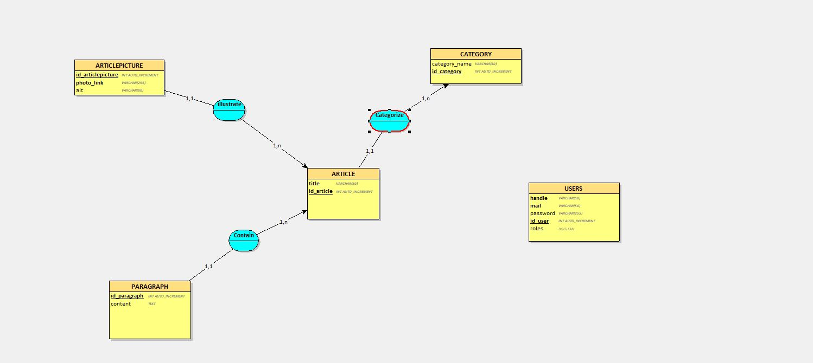

# Le Fond Du Filet
Projet de soutenance Kercode

## A propos du Projet : 

A l'occasion du projet final de Kercode, j'ai réalisé un site internet de type blog sur le thème du football, 
les utilisateurs peuvent consulter une variétés d'article rangés en différentes catégories.
Les articles, à l'heure actuelle sont uniquement soumis par un admin. 

### Technologies employées :

J'ai utilisé Looping (https://www.looping-mcd.fr/) pour créer ma base de données.

Voici le schéma conceptuel de celle-ci:



#### Langages :
- HTML
- CSS
- JavaScript
- PHP
- MySQL

#### Utilitaires
- Composer
- Looping
- VSCode
- PHPMyAdmin

## Installation du projet

Lien du repository:
https://github.com/Crapouillou/Le-Fond-du-Filet

En tout premier lieu, via la console, effectuer un git clone

* Git clone
```sh
git clone https://github.com/Crapouillou/Le-Fond-du-Filet
```

* Installer Composer si vous ne l'avez pas (https://getcomposer.org/download/) puis effectuer en ligne de commande un 

```sh
composer install
```

* Variables d'environnement
  
Renommer le fichier .env.example en .env en remplissant les champs adéquats

```
 DB_NAME= 'Ecriver ici votre nom de base de données'
 DB_HOST= 'Ecriver ici votre nom d hote'
 DB_PORT= 'Ecriver ici votre port'
 DB_USERNAME= 'Ecriver ici votre nom d utilisateur'
 DB_PASSWORD='Ecriver ici le mot de passe de connexion a la base de donnée'
 ```


## Base de données

La base de données `lefonddufilet.sql` se trouve à la racine du projet. C'est un export d'une base de donnée pré-remplie avec 15 article

Il y a deux utilisateurs enregistrés:


L'administrateur pour accéder à la création d'articles ainsi que de catégories:
```
Login : admin
MdP : admin
```
Un utilisateur :
```
Login : user
MdP : user
```
Vous pouvez accéder au dashboard et au compte utilisateur via la rubrique 'Mon Compte'


## Contact

Pour toute question concernant l'installation du projet vous pouvez me contacter par mail:

```
thomas_karl@hotmail.com
```

## Remerciements

Je tiens à remercier les personnes qui m'ont aidé à la réalisation de ce projet ainsi que le Greta de Vannes et tout particulièrement nos deux formateurs dévoués Marie-Christine L. et Thierry B. pour leur aide précieuse et leur bonne humeur.

